# CXL-SHM：Non-blocking Partial Failure Resilient Memory Management System

The efficiency of distributed shared memory (DSM) has been greatly improved by recent hardware technologies. But, the difficulty of distributed memory management can still be a major obstacle to the democratization of DSM, especially when a partial failure of the participating clients (due to crashed processes or machines) should be tolerated.

Therefore,we present **CXL-SHM**, an automatic distributed memory management system based on reference counting. The reference count maintenance in CXL-SHM is implemented with a special era-based non-blocking algorithm. Thus, there are no global blocking, memory leak, double free, and wild pointer problems, even if some participating clients unexpectedly fail without destroying their possessed memory references. We evaluated our system on real CXL hardware with both micro-benchmarks and end-to-end applications, which demonstrate the efficiency of CXL-SHM and the simplicity and flexibility of using CXL-SHM to build efficient distributed applications.

For more details, please refer to our paper.


## Requirements and Overview

#### Hardware Environment
1. Recommended Simulation Platform: General Linux Server (Phyical Machine or Bare Mental Server in Cloud). It would be feasible to utilize a separate NUMA socket's DRAM as a means to emulate the remote CXL hardware. The goal is to facilitate the reproduction of our results. Using remote NUMA to simulate CXL latency is similar to previous works. It's worth noting that our preliminary evaluations indicate a similarity in performance between a remote CXL memory and a cross-NUMA access (Pond [^1] and TBB [^2]). 
2. Original CXL Platform: Intel Linux Server with Sapphire Rapids CPU and FPGA device (Intel Agilex I/Y serial) with R-Tile [^5]. CXL device is configured as devdax mode.
3. (Optional) RDMA Platform: It can produce the results of baseline in Figure 6. This platform should equip with Mellanox/Nvidia 50GBps ConnectX-5 RDMA NIC.

#### Software Environment
* Linux Kernel >= 5.10.134
* OS version >= CentOS 7
* CMake >= 3.5+
* Jemalloc: jemalloc = 5.2.1-2.1.al8, jemalloc-devel = 5.2.1-2.1.al8
* Intel TBB: tbb = 2018.2-9.2.al8, tbb-devel = 2018.2-9.2.al8
* gcc with C++11 support (10.2.1 in our environment)
* Main Memory >= 32GB
* CPU >= 88 cores \& >= 44 physical cores (because the maximum thread number is 88 in the evaluations)

#### Dataset
`LiveJournal` Dataset in SNAP project. It is used in PageRank test and Graph test. You can download it from here [^6].

## Reproduce Steps

#### Prepare Evaluation environment

Please choose one of the available environments to complete the reproduction process.

##### CXL environment
* If your environments equip CXL devices with CXL1.1 driver. Please check the device first to ensure the CXL1.1 driver can enumerate the CXL device.
```shell
ls dax[n].[m]
```
*  Next you can use daxctl tool to create a dax (Direct Access) device for evaluations. 
```shell
daxctl reconfigure-device -f -m devdax dax[n].[m]
```
* Finally, check CXL device is configured as dax device. An example of CXL dax device.
```shell
daxctl list
```
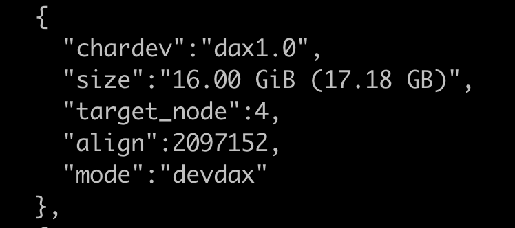

##### Simulation environment
* General Linux Server must have **at least two NUMA nodes**, because a separate NUMA socket's DRAM is used to emulate the remote CXL hardware. Besides, `numactl` and `numactl-devel` should be installed.
```shell
yum install numactl
yum install numactl-devel
```

#### Build CXL-SHM

Prerequisites (using root previlege) to install dependency softwares (`jemalloc` and `tbb`).
```shell
yum install jemalloc jemalloc-devel
yum install tbb tbb-devel
``` 

All following commands assume that you are in the root directory of this repo. 

CXL-SHM should know the CPU topologies of your server. So you can run `get-numa-config.sh` script to acquire the details. Before that, you should make sure python3 is installed. After 
```shell
yum install python3 #(or some other commands)
sh test/get-numa-config.sh
```

##### CXL environment
If you have the CXL environment (By default, `USE_CXL` option is ON). the cxl device should be configured as dax device. Then you should modify `CXL_DAX_DEV` in `cxlmalloc-internal.h` as the path of dax device (e.g., `/dev/dax[n].[m]`).

```shell
mkdir build && cd build
cmake ..
make
```

##### Simulation environment
If you use emulation environment. As another said, if you don't have the real hardware platform described in CXL environment, we provide emulation methods by disabling the `USE_CXL` option in `CMakeLists.txt`. 
```shell
mkdir build && cd build
cmake .. -DUSE_CXL=OFF
make
```

#### Dataset

Download the `LiveJournal` dataset used in PageRank test and Graph test. Make sure you are in the `build` directory.
```shell
wget https://snap.stanford.edu/data/soc-LiveJournal1.txt.gz
yum install gzip
gunzip soc-LiveJournal1.txt.gz
```

#### Baseline

Ralloc project provides benchmarks to evaluate `Jemalloc`, `Ralloc` and PMDK. Thus we utilize this project as the baseline by adding the support of `Mimalloc`.
```shell
git clone https://github.com/urcs-sync/ralloc.git
cd ralloc
git apply [CXL-SHM home path]/ralloc.patch
```

Phoenix is a shared-memory implementation of Google's MapReduce model for data-intensive processing tasks.
```shell
git clone https://github.com/kozyraki/phoenix.git
cd phoenix/sample_apps
cd kmeans; make
```

Lightning is a high-performance in-memory object store without requiring  IPC overheads on kv operations.
```
git clone https://github.com/danyangz/lightning.git
docker build -t lightning .
```


#### Reproduce the data in the Evaluations

To reproduce the results of this paper, we provide scripts in the ```scripts/``` directory. Also, we have included several screenshots to illustrate the results of **CXL-SHM** in our cxl platform.

Tips:
1. You should use `sh` or `bash` to run all these scripts.
2. All these scripts should be run in the build directory, thus you can link scripts to the build directory fisrt.
```shell
ln -s ../script .
```
3. To verify that the remote NUMA's DRAM is used as CXL memory, please use `numastat` or other tools. For example, as shown in  this screenshot, high shmem footprint could be seen.
```shell
numastat -m
``` 
* 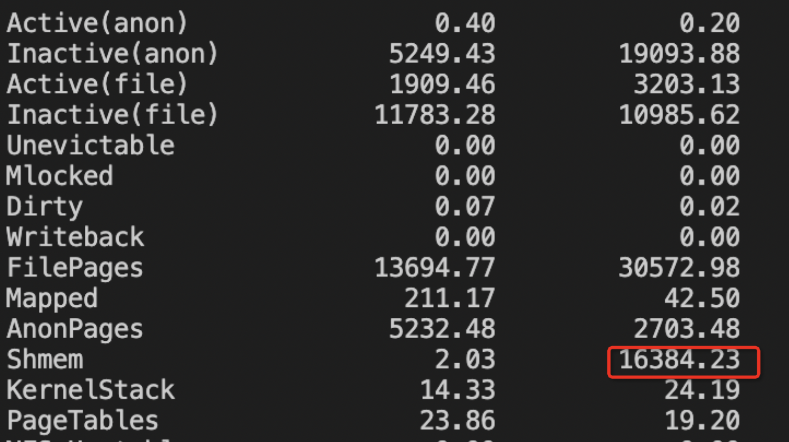

#### Figure 5
* To reproduce **CXL-SHM** in Figure 5, use `run_shbench.sh` and `run_threadtest.sh`. Please note that the results are elapsed time, the final results should be transformed according the definition of the original shbench/threadtest (we use the default configurations in Ralloc Project [^3]). 
* shbench: `throughput (MOPS)` = 12.5 / time` and threadtest: `100 / time`.
```shell
sh ./script/run_shbench.sh
sh ./script/run_threadtest.sh
```
* To reproduce the comparsions (Ralloc, Jemalloc, Mimalloc) in Figure 5, please use the benchmark in Ralloc Project [^3]. Note that we use the same parameters as Ralloc (1000 iterations, 100000 objects, 8 sz). Before that, if you **use CXL environment** please make sure **CXL device is configured as system ram mode**. Use following commands to do this. After that, use `numactl --membind=[cxl node id]` to ensure that program can allocate CXL memory.
```shell
daxctl reconfigure-device -f -m system-ram dax[n].[m]
```

* Here is an example of the output after running the command.
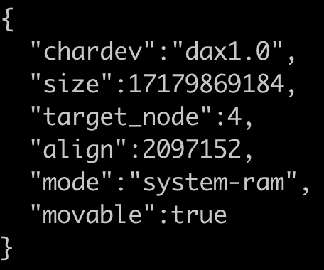

* Here are several steps to reproduce the baselines.
```shell
cd test
make ALLOC=r
./run_shbench.sh r
./run_threadtest.sh r
make ALLOC=je
./run_threadtest.sh je
./run_shbench.sh je
make ALLOC=mi
./run_shbench.sh mi
./run_threadtest.sh mi
```

* CXL environment
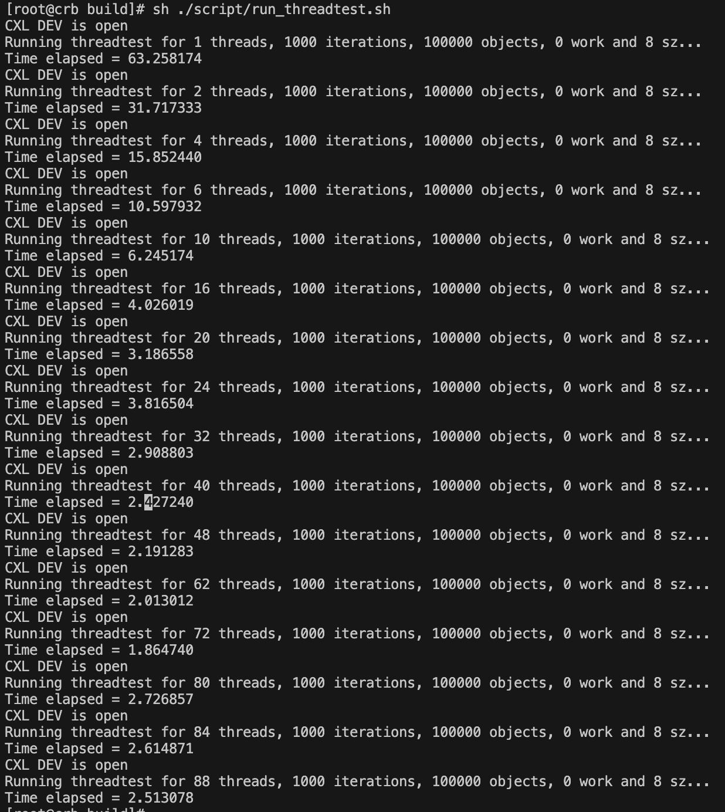
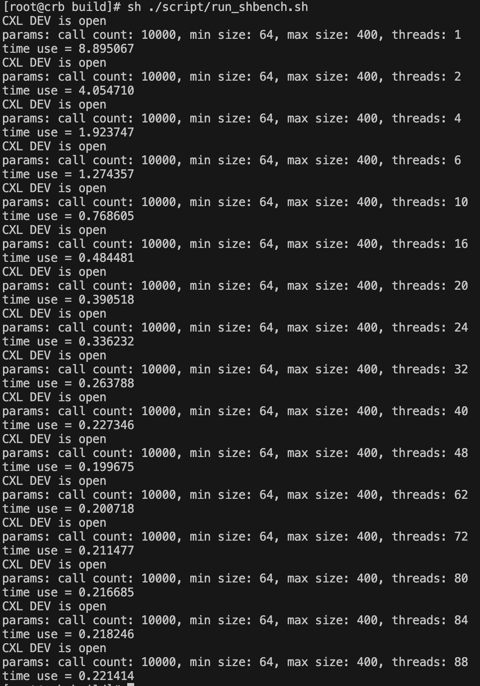

* Simulation environment
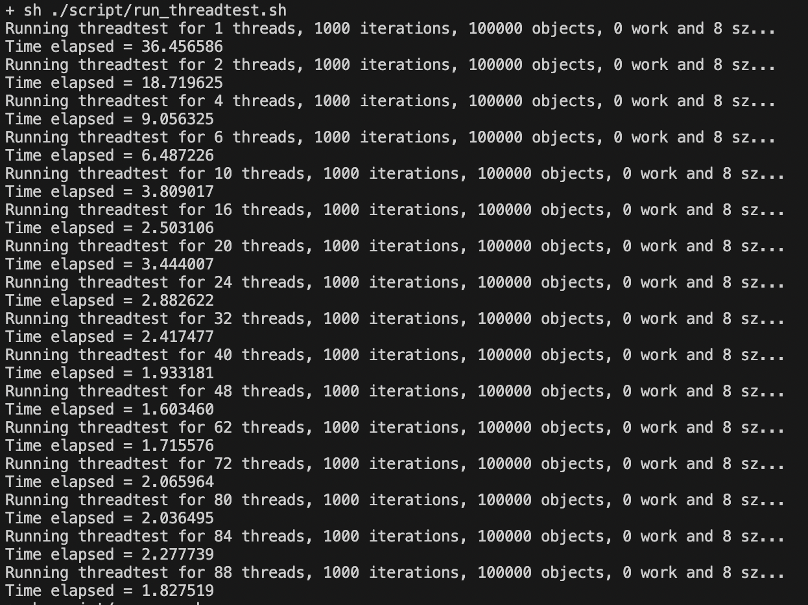
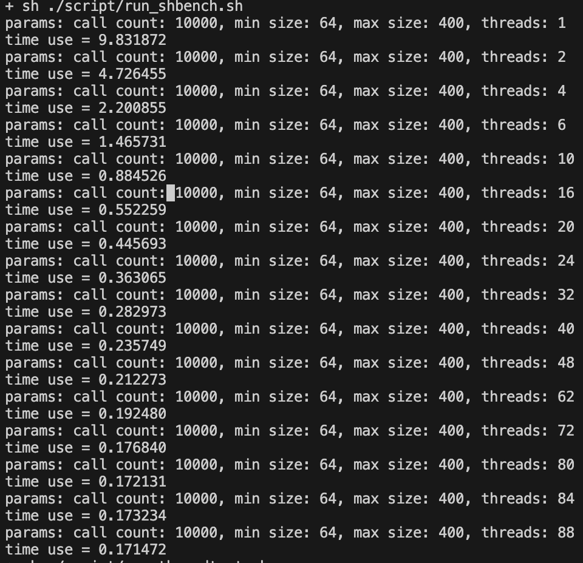

#### Figure 6
* To reproduce CXL-SHM RPC in Figure 6, use `run-rpc.sh`. Because the performance of CXL-SHM RPC is unrelated to the size of payload, in the different payload size test, we use the data of one client and one server in `run-rpc.sh` as the consistent (invariable) performance.
```shell
sh script/run_rpc.sh
```
* To reproduce the data of SPSC, please use the larson test (a benchmark for SPSC) in Ralloc Project [^3].
```shell
./run_larson.sh je
```

* We use `ibv_rc_pingpong` tool to mimic RPC RPC. To reproduce the results of RDMA RPC in the left figure, you should run multiple `ibv_rc_pingpong` instance. To reproduce the results of RDMA RPC in the right figure, you should indicate different payload size (2^6~2^22 Bytes) in `ibv_rc_pingpong`. Because the results are presented in latency (e.g., $\mu s$), you should tranform the data into throughput ($througput = \frac{1}{latency}$).
```shell
# Left Figure
# In server side
for((i=0;i<=[server number];i++)) do ibv_rc_pingpong -n 1000000 -p $((10000+i)) >> rdma-server.txt &; done
# In client side
for((i=0;i<=[server number];i++)) do ibv_rc_pingpong -n 1000000 -p $((10000+i)) >> rdma-client.txt &; done

# Right Figure
# In server side
ibv_rc_pingpong -s [payloadsize] -n 1000000
# In client side
ibv_rc_pingpong -s [payloadsize] -n 1000000 [server IP]
```


* CXL environment
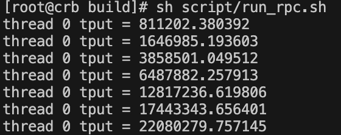

* Simulation environment
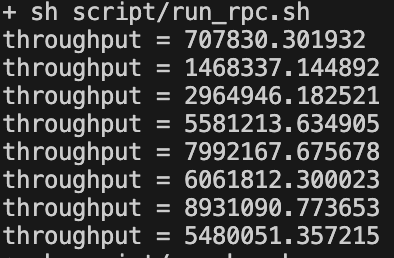


#### Figure 7
* To reproduce Figure 7, use `run-kmeans.sh` and `run-wc.sh`. 
<!-- * Before that,  in `run-pr.sh`, please setup the `path` as the dataset file (LiveJournal in our evaluations). -->
```shell
sh script/run-kmeans.sh
sh script/run-wc.sh
```

* To reproduce the comparsions (Phoenix), please use the benchmark in Phoenix Project [^4]. Follow the README to compile the project, and use the apps named ```wordcount``` and ```kmeans``` in the directory ```sample_apps```. Note that ```wordcount``` requires 1GB random generated txt as the input (the same as our implementation of work count). Copy below scripts to the Phoenix directory and run them can reproduce the results. 
```shell
sh script/run-km-phoenix.sh
sh script/run-wc-phoenix.sh
```

* CXL environment
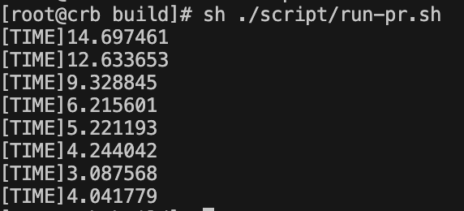
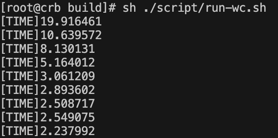

* Simulation environment
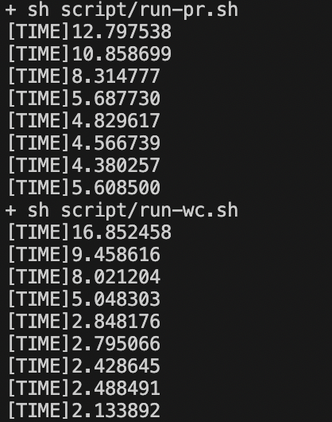

#### Figure 8
* Figure 8a
  * To reproduce the data of CXL-KV in Figure 8a, use `run_kv.sh`
  * To reproduce the data of CXL-TBB in Figure 8a, use `run_kv_baseline.sh`
```shell
sh script/run_kv.sh
sh script/run_kv_baseline.sh
```
  * To reproduce the data of Lightning, please use docker to construct the environment for compiling and running Lightning (see `README` of Lightning). After that, use `throughput.sh` in `script` dir.

* Figure 8b: To reproduce the data of CXL-KV with different Write/Read Ratio in Figure 8b, use `run_kv_ratio.sh`
```shell
sh script/run_kv_ratio.sh
```

* Figure 8c: To reproduce the data of CXL-KV with different zipf parameter (.5, .9 and .99) in Figure 8c, use `run_kv_zipf.sh`
```shell
sh script/run_kv_zipf.sh
```

* Figure 8d: To reproduce Figure 8d, use `run-smallbank.sh` and `run-tatp.sh`. Besides, we provide two scripts to produce the results of the baselines (`run-smallbank-tbb.sh` and `run-tatp-tbb.sh`).
```shell
sh script/run-smallbank.sh
sh script/run-tatp.sh
sh script/run-smallbank-tbb.sh
sh script/run-tatp-tbb.sh
```

<!-- 


 -->

* Figure 8e: To reproduce the throughput of Intersect and 2 Hops Query of CXL-Graph in Figure 8e, use `run_graph.sh`. Before that, please setup the `path` as the graph dataset file (LiveJournal in our evaluations).
```shell
sh script/run-graph.sh
```

* CXL environment
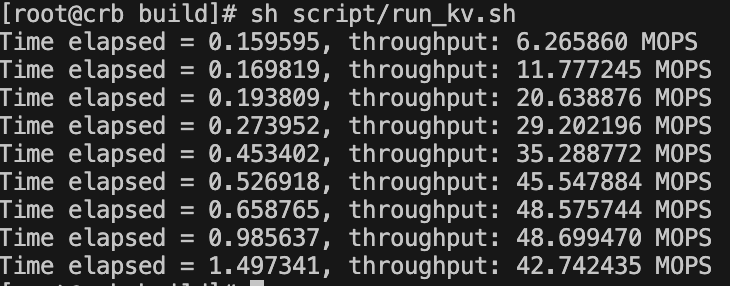
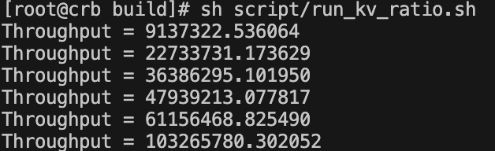
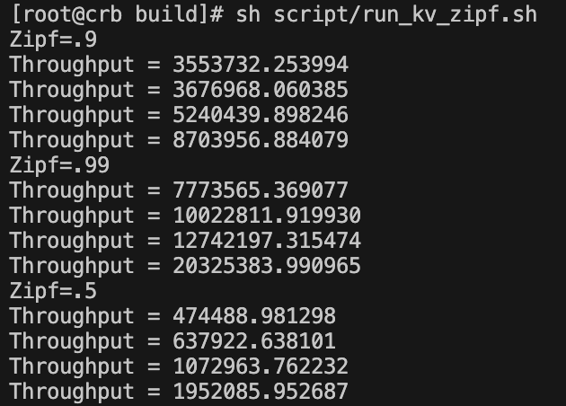
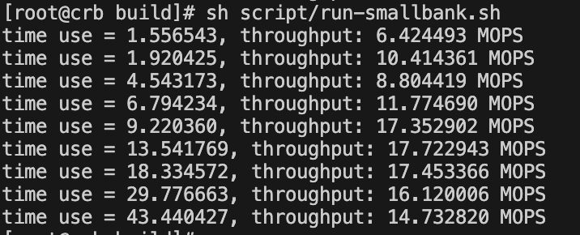
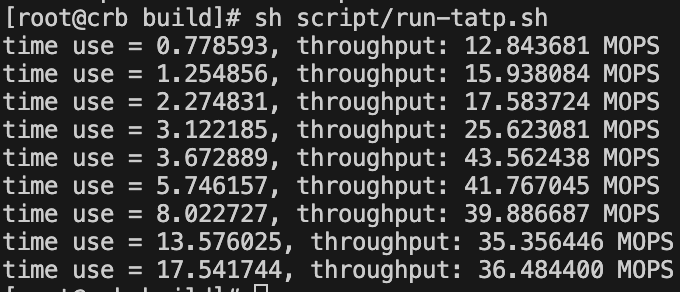
<!-- 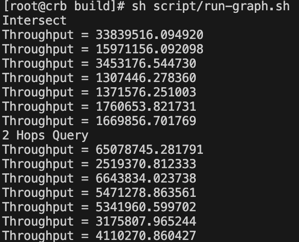 -->

* Simulation Environment
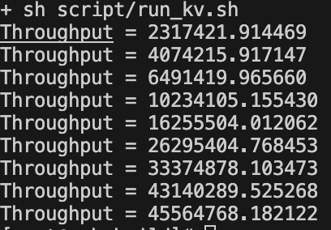
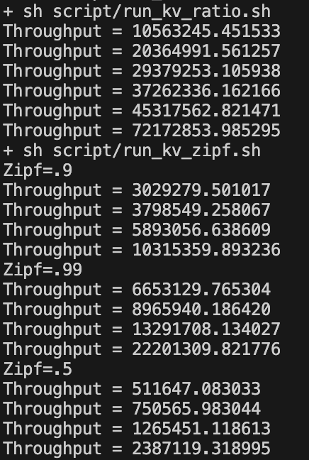
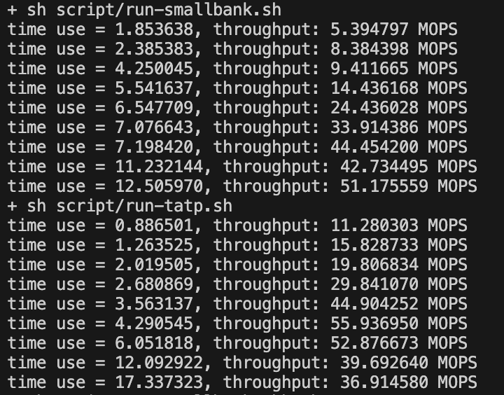
<!-- 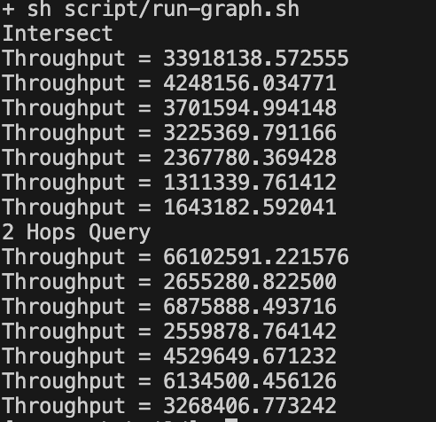 -->

#### Recovery

We provide fault injection option to test recovery function, do:
```shell
cmake .. -DFAULT_INJECTION=ON
make
bash run_recovery_test.sh
```
This is an infinite loop and if the shell does not display a `segmentation fault` alert, it indicates that the recovery process has been successful.


## Documantation of CXL-SHM

#### Code structure

| Directory      | Description                                                  |
| -------------- | :----------------------------------------------------------- |
| include        | Declaration of System Interface                              |
| script         | Scaripts which can reproduce the results in the paper        |
| src            | Implementation details mentioned in this paper               |
| test           | correctness test, including api test, stress test and fault recovery test |
| test/benchmark | Benchmarks(threadtest, shbench, rpc micro benchmark, kv, mapreduce(wordcount, pagerank), TATP, SmallBank) |

#### Correctness test

To run the correctness test including api test and stress test, do:

1. ```ctest```

You can also run single correctness test, do:

1. ```./cxlmalloc-test-<api|stress>```

#### Benchmark

We provide several benchmark programs to evaluate the throughput in different scenarios, and there are different parameters for these tests (see details). To run these benchmarks, do:

* Thread test: ``` ./cxlmalloc-benchmark-threadtest [thread number] > threadtest.out```
* Shbench: ```./cxlmalloc-benchmark-sh6bench [thread number] > shbench.out```
* RPC:
  * ```./cxlmalloc-benchmark-rpc_client [thread number] > client.out ```
  * After ```client.out``` has output (queue is added to share memory), do ```./cxlmalloc-benchmark-rpc_server [thread number] > server.out ```
* Map Reduce: 
  * Word Count ```./cxlmalloc-benchmark-wc [map number] [reduce number] [data length] > wc.out```
  * K-Means ```./cxlmalloc-benchmark-km [map number] [reduce number] [points number] [dimensions] [iterations] > km.out```
* KV: ```./cxlmalloc-benchark-kv [threads number] [read ratio] > kv.out```

* TATP: ``` ./cxlmalloc-benchark-tatp [thread number] > tatp.out```
* SmallBank: ```./cxlmalloc-benchmark-smallbank [thread number] > smallbank.out```
* Graph ```./cxlmalloc-benchmark-graph [thread number] [max vertex id] [total edge number] [file path of graph] [Query Mode] > graph.out```


[^1]: Li, Huaicheng, et al. Pond: CXL-based memory pooling systems for cloud platforms. Proceedings of the 28th ACM International Conference on Architectural Support for Programming Languages and Operating Systems, Volume 2. 2023.
[^2]: Maruf, Hasan Al, et al. TPP: Transparent page placement for CXL-enabled tiered-memory. Proceedings of the 28th ACM International Conference on Architectural Support for Programming Languages and Operating Systems, Volume 3. 2023.
[^3]: https://github.com/urcs-sync/ralloc
[^4]: https://github.com/kozyraki/phoenix.git
[^5]: https://www.intel.com/content/www/us/en/products/details/fpga/development-kits/agilex/i-series.html
[^6]: https://snap.stanford.edu/data/soc-LiveJournal1.html
[^7]: https://github.com/danyangz/lightning
